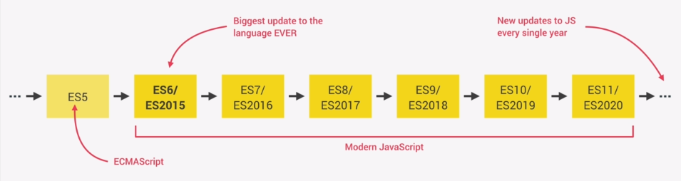

## What is JavaScript?

JavaScript is a high-level, object-oriented, and multi-paradigm programming language.

- High-level: You don't need to worry about low-level details like memory management.
- Object-oriented: Based on objects, which are used to store and manipulate most types of data.
- Multi-paradigm: You can use different programming styles, such as procedural, object-oriented, or functional programming.
- Programming language: Used to instruct computers to perform tasks.

## The Role of JavaScript in Web Development- 

- HTML: Represents the nouns (structure and co- ntent).
- CSS: Represents the adjectives (styles and appearance).
- JavaScript: Represents the verbs (dynamic behavior and actions).


## What JavaScript Can Do
- Front-end apps: Adds dynamic effects and functionality to web applications in the browser.
- Back-end apps: Powers web applications on servers using frameworks like Node.js.
- Native desktop applications: Build cross-platform apps with frameworks like Electron.
- Native mobile applications: Create mobile apps using tools like React Native.


## JS Releases

<p align="center">
  
</p>

## Primitive Data Types in JS

1. Number: Represents both integer and floating-point numbers. For example, 42, 3.14.

2. String: Represents a sequence of characters. For example, "Hello, world!".

3. Boolean: Represents a logical value, either true or false.

4. Undefined: Represents a variable that has been declared but not assigned a value. Its default value is undefined.

5. Null: Represents the intentional absence of any object value. It is often used to indicate that a variable should be empty.

6. Symbol: Represents a unique and immutable value, often used as object property keys.

7. BigInt: Represents whole numbers larger than 2^53 - 1, which is the limit for the Number type. For example, 9007199254740992n.

`Hint` typeof null is object


## Declaration of variables

- var 
  
  - `Scope`: Function-scoped (or globally-scoped if declared outside a function).
  
  ```js
    function example() {
      if (true) {
          var x = 10; // x is declared within this function
      }
      console.log(x); // x is accessible here because var is function-scoped
    }

    example(); // Outputs: 10
  ```
  
  - `Hoisting`: Variables declared with var are hoisted to the top of their scope and initialized with undefined.
  
  - `Re-declaration`: Allowed within the same scope.

- let
  
  - `Scope`: Block-scoped (only accessible within the block it is declared).
  
  - `Hoisting`: Variables declared with let are hoisted but not initialized. Accessing them before their declaration results in a ReferenceError (Temporal Dead Zone).
  
  - `Re-declaration`: Not allowed within the same scope.
  
- const
  - `Scope`: Block-scoped (like let).
  
  - `Hoisting`: Similar to let, variables are 
  hoisted but not initialized.
  
  - `Re-declaration`: Not allowed within the same scope.
  
  - `Assignment`: Must be initialized at the time of declaration and cannot be reassigned. However, objects and arrays declared with const can still be modified.

- global var
  
  ```js
  // This is global variable
  name = "js"
  console.log("The name of Language is :", name)
  ```

## Operation with string 


```js
// Using a template literal to include the variable in the text
let n = "js";

let all = `My programming language is ${n} and funny language (this is not true)`;

console.log(all);

// Adding new lines within the string
all = `My programming language is ${n} \n and funny \n language (this is not true)`;

console.log(all);
```

##  Type Conversion and Coercion

- `Type Conversion`
  
  ```js
  // When a string is added to a number, the number is converted to a string, and concatenation occurs.
  const inputYear = '1991';
  console.log(inputYear + 18);  // Output: '199118' (string)

  // Convert the string '1991' into a number before performing the addition.
  console.log(Number(inputYear) + 3894);  // Output: 5885 (number)

  // NaN (Not a Number) example
  // Trying to convert a non-numeric string into a number will result in NaN.
  console.log(Number("Abdelrahman"));  // Output: NaN

  // NaN is still of type 'number' even though it represents an invalid number.
  console.log(typeof NaN);  // Output: 'number'

  // Convert a number into a string explicitly using String().
  console.log(String(23));  // Output: '23' (string)

  ```
- `Type Coercion`
  
  ```js
  // Demonstrating type coercion in JavaScript

  // These three lines produce the same output due to type coercion,
  // where the number 23 is converted to a string and concatenated with the others.
  console.log('I am ' + 23 + " years old");
  console.log('I am ' + String(23) + " years old"); // Explicitly converting 23 to a string
  console.log('I am ' + '23' + " years old"); // Directly using the string '23'

  // Subtraction causes JavaScript to coerce the strings into numbers.
  // The result will be a number after performing the subtraction.
  console.log('10' - '30' - 19); // The strings '10' and '30' are treated as numbers here.

  // Example of how JavaScript coerces a string into a number during subtraction
  // '1' is a string, but the minus sign triggers coercion to a number.
  let n = '1' - 1; // Result is 0, and the type is Number
  console.log("During subtraction: ", n, "and its type is: ", typeof n);

  // Subtracting again to demonstrate further coercion
  n = n - 1; // Now the result is -1, still a Number
  console.log("During subtraction again: ", n, "and its type is: ", typeof n);

  ```
## Falsy and Truthy Values

In JavaScript, there are 5 falsy values: 0, '' (empty string), undefined, null, and NaN.

Anything that is not one of these is considered truthy.

## The Difference Between == and ====

- `==`
  
  (loose equality) **`compares values`** after performing type coercion, meaning it converts the types if necessary before comparing.

- `===`
  
  (strict equality) **`compares both the value and the type`**, without any type conversion.