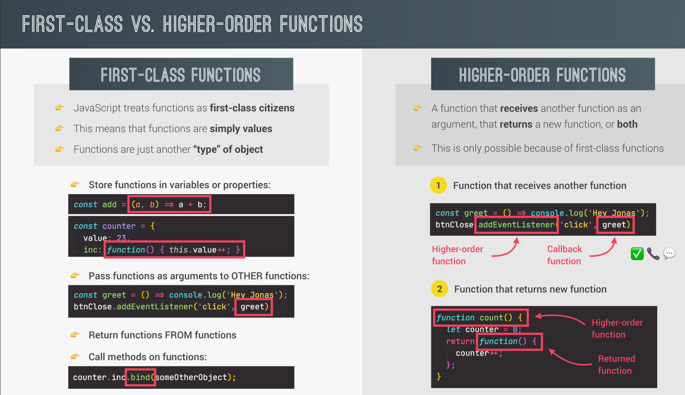
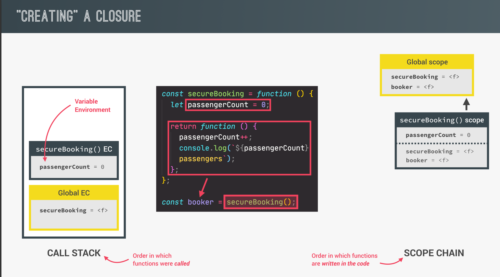
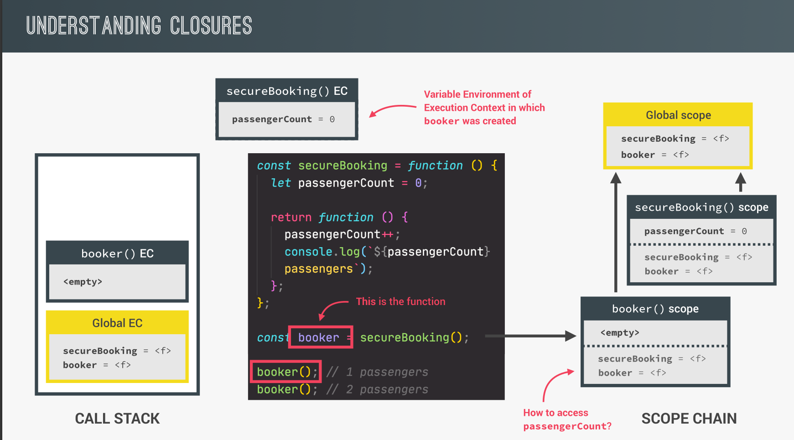
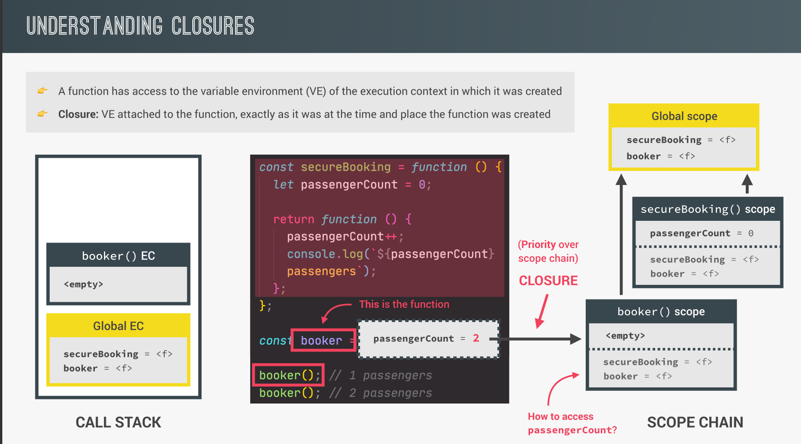

## Default Parameters

```js
const bookings = [];

// Initial createBooking function
const createBooking = function (flightNum, numPassengers, price) {
  const booking = {
    flightNum,
    numPassengers,
    price,
  };
  console.log(booking); // Output: { flightNum: 'LH123', numPassengers: undefined, price: undefined }
  // This output is not ideal for users. To avoid this, we will use default parameters.
  bookings.push(booking);
};

// Updated createBooking function with default parameters
const createBooking = function (
  flightNum,
  numPassengers = 1, // Default value of 1 if not provided
  price = numPassengers * 200 // Price defaults to numPassengers * 200
) {
  const booking = {
    flightNum,
    numPassengers,
    price,
  };
  console.log(booking);
  bookings.push(booking);
};

// Example usage
createBooking("LH123"); // Output: { flightNum: 'LH123', numPassengers: 1, price: 200 }
```

## Passing Arguments by value Vs reference

1. Passing by Value

   When you pass a primitive type (like numbers, strings, booleans, etc.) to a function, the value is copied. Any changes made inside the function will not affect the original variable outside the function.

   ```js
   let age = 25;
   function changeAge(val) {
     val = 30; // This only changes the local copy of `val`
     console.log("Inside function:", val); // Inside function: 30
   }
   changeAge(age);
   console.log("Outside function:", age); // Outside function: 25 (unchanged)
   ```

2. Passing by Reference

   When you pass an object (or array) to a function, JavaScript passes a reference to the object. This means changes made inside the function do affect the original object outside the function.

   ```js
   let person = { name: "John", age: 25 };

   function changePerson(obj) {
     obj.age = 30; // This changes the original object
     console.log("Inside function:", obj); // Inside function: { name: 'John', age: 30 }
   }

   changePerson(person);
   console.log("Outside function:", person); // Outside function: { name: 'John', age: 30 } (changed)
   ```

## First Class Vs High Order

<p align="center">
  
</p>

1. First Class

   ```js
   // A first-order function that takes two numbers and returns their sum
   function add(a, b) {
     return a + b;
   }

   // Using the first-order function
   const result = add(5, 3);
   console.log(result); // Output: 8
   ```

2. Hight Order

   - Passing a function to another function

     ````js
       // Passing a function to another function
       const onWord = function (str) {
         return str.replace(/ /g, "").toLowerCase();
       };
       const upperFirstWord = function (str) {
         const [first, ...other] = str.split(" ");
         return [first.toUpperCase(), ...other].join(" ");
       };
       // Higher-order function and this function achieves the concept of abstraction.
       const transformer = function (str, fn) {
         console.log(`Original String: ${str}`);
         console.log(`Tranformed String: ${fn(str)}`);

         console.log(`Function that is used: ${fn.name}`);
       };
       // Passing function ==> upperFirstWord
       transformer("JavaScript is stuiped language!", upperFirstWord);
       ```
     ````

   - Return Function from Function

     ```js
     // Using Regular Function
     const greet = function (greeting) {
       return function (name) {
         console.log(`${greeting} ${name}`);
       };
     };
     const greeterHey = greet("Hey");
     greeterHey("abdelrahman");

     //Using Arrow Function
     const greet = (greeting) => (name) => console.log(`${greeting} ${name}`);
     greet("Hallo")("Osama");
     ```

## call, apply and bind Methods

- Call Method

  Usage: Invokes a function and allows you to pass arguments **individually**.

  ```js
  const lufthansa = {
    airline: "Lufthansa",
    iataCode: "LH",
    bookings: [],
    // book: function()
    book(flightNum, name) {
      console.log(
        `${name} booked a seat on ${this.airline} flight ${this.iataCode}${flightNum}`
      );
      this.bookings.push({ flight: ` ${this.iataCode}${flightNum}`, name });
    },
  };

  lufthansa.book(239, "Jonas Schmedtmann");

  const eurowings = {
    name: "Euroings",
    iataCode: "EW",
    bookings: [],
  };

  const swiss = {
    name: "Swiss Air Lines",
    iataCode: "LX",
    bookings: [],
  };
  const book = lufthansa.book;
  // book(23, "Sarah Willams"); //undefined
  // *Error Occured**

  // The error occurs because the book function relies on this to refer to the lufthansa object, but when you assign book to a new variable (or use it on a different object), this loses its original reference.
  // In JavaScript, when you extract a method like this and call it on its own, this becomes undefined (in strict mode) or refers to the global object (in non-strict mode).
  // In your case, since book is called without being bound to an object,
  // this.airline and this.iataCode will cause the error as they try to access properties of undefined.

  // To fix it, use the function for a specific object by using the call method.

  // Like this:

  book.call(eurowings, 233, "Abdelrahman");
  // Output: Abdelrahman booked a seat on Euroings flight EW233
  book.call(swiss, 3434, "Hussien");
  // Output: Hussien booked a seat on Swiss Air Lines flight LX3434
  ```

- Apply Method

  Usage: Invokes a function and allows you to pass arguments as an **array**.

  ```js
  const flightData = [233, "Hassan"];
  book.apply(swiss, flightData);
  //Output: Hassan booked a seat on Swiss Air Lines flight LX233
  ```

- bind Method

  The bind method in JavaScript creates a new function that, when invoked, has its this keyword set to a specific value.

  bind returns a copy of the function with a fixed this context, which can be called later.

  ```js
  // For these function ==> args are flightNum and name
  // book function for eurowings object
  const bookForEuro = book.bind(eurowings);
  // book function for lufthansa object
  const bookForLu = book.bind(lufthansa);
  // book function for swiss object
  const bookForSw = book.bind(swiss);

  // Calling these functions
  bookForEuro(26, "swsan");
  bookForLu(325, "faten");
  bookForSw(3234, "maream");

  // For These functions ==> args are only name

  const bookEW34 = book.bind(eurowings, 34);

  bookEW34("Gamal");
  ```

  **Example 1:**

  You want to increment the planes property of the lufthansa object when clicking the "Buy new plane" button. However, when you attach the buyPlane function to the button's click event, the this keyword inside the function refers to the button element **button** instead of the lufthansa object. This happens because the this keyword depends on the context where the function is invoked.

  **stituation:**

  ```js
  // Add new variable and new function
  lufthansa.planes = 300;
  lufthansa.buyPlane = function () {
    console.log(this); // Logs the current context (which is the button in the event listener)
    this.planes++; // This will cause an error or not work as expected
    console.log(this.planes);
  };

  // When using the function like this, `this` refers to the button
  document.querySelector(".buy").addEventListener("click", lufthansa.buyPlane);

  // Output when clicking: this ---> <button class="buy">Buy new plane 🛩</button>
  ```

  **Problem:**

  When the buyPlane function is triggered by the button click, this refers to the button **button** instead of the lufthansa object, so the planes property is not incremented.

  **Solution:**

  ```js
  // Using bind to fix the `this` context issue
  document.querySelector(".buy").addEventListen.("click", lufthansa.buyPlane.bind(lufthansa));

  // Now clicking the button correctly increments the planes property.
  ```

  **Example 2:**

  **First Way using bind method**

  ```js
  const addTax = (rate, value) => value + value * rate;

  console.log(addTax(0.1, 200)); // Output: 220

  // For the bind method, the first argument refers to the "this" value. However, since arrow functions don't use the "this" keyword, we can pass null. The addTax function is reused with a constant rate (0.23), but the value can be changed when calling the new function.

  const addAvt = addTax.bind(null, 0.23);
  console.log(addAvt(200)); // Output: 246
  ```

  **Another way using high order functions:**

  ```js
  const addTax = function (rate) {
    return function (value) {
      return value + value * rate;
    };
  };
  const addAvt2 = addTax(0.23);
  addAvt2(200);
  ```

## Immediately Invoked Function Expressions(IIFE)

- Is defined and immediately executed as soon as it’s created.
- It runs once and does not pollute the surrounding scope with variables or functions.

```js
// Regular Function
(function () {
  console.log("this will never run again");
})();
// Arrow Function
(() => console.log("this will also never run again"))();
```

## Closures

**closures** are a fundamental concept where an inner function has access to variables from its outer function, even after the outer function has finished executing

When a function is declared inside another function, it forms a **closure**, allowing the inner function to access variables from the outer function, its own variables, and any global variables if they exist.

**Behind The Scene For Closures**

Even if the outer function completes execution, the inner function (closure) retains access to the variables of the outer function, because they are preserved in memory.

<p align="center">
  
</p>

<p align="center">
  
</p>

<p align="center">
  
</p>

**Why Closures Are Useful:**

- `Data privacy`: They allow you to create private variables that cannot be accessed from outside.
- `Callbacks and event handlers`: Closures are often used in callbacks and asynchronous programming.
- `Partial applications`: Closures are used to store some state or pre-configure a function.

**Callback Functions**

Callback functions are functions that are passed as `arguments` to another function and are intended to be executed after a certain event or condition occurs. They enable `asynchronous` behavior in JavaScript, allowing code to continue running while waiting for an operation (like an API request or timer) to complete.
