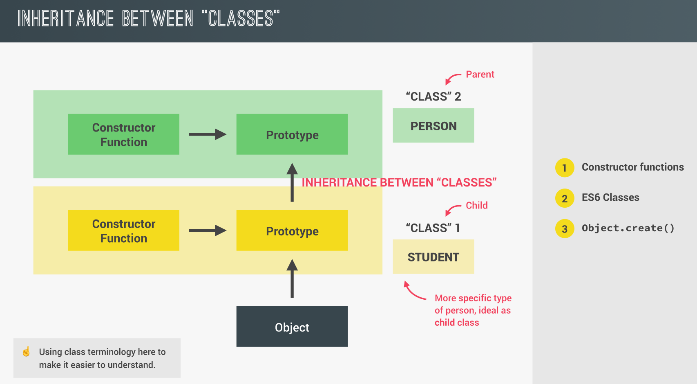
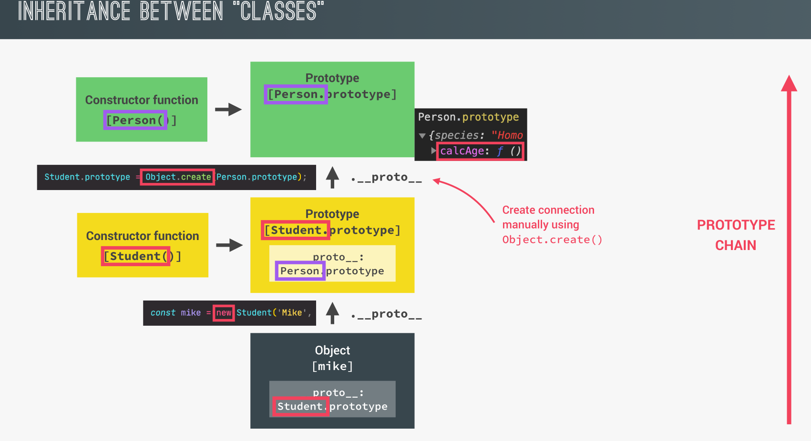
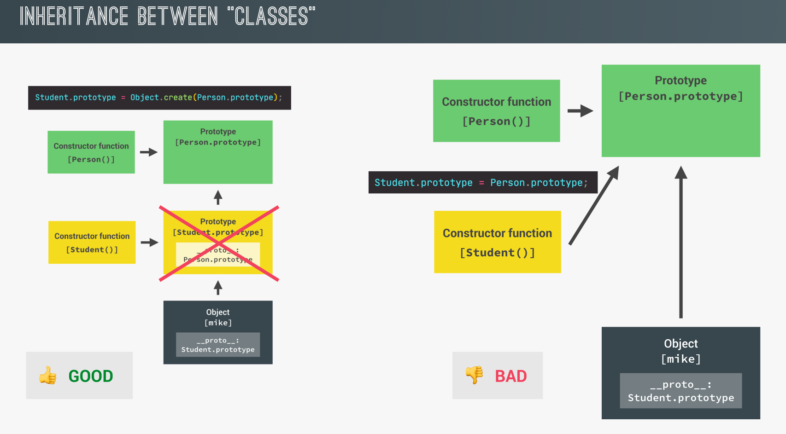
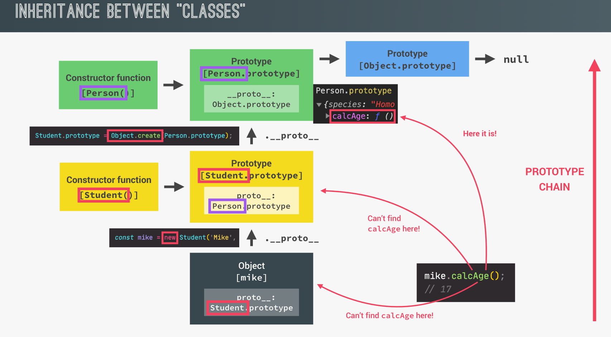
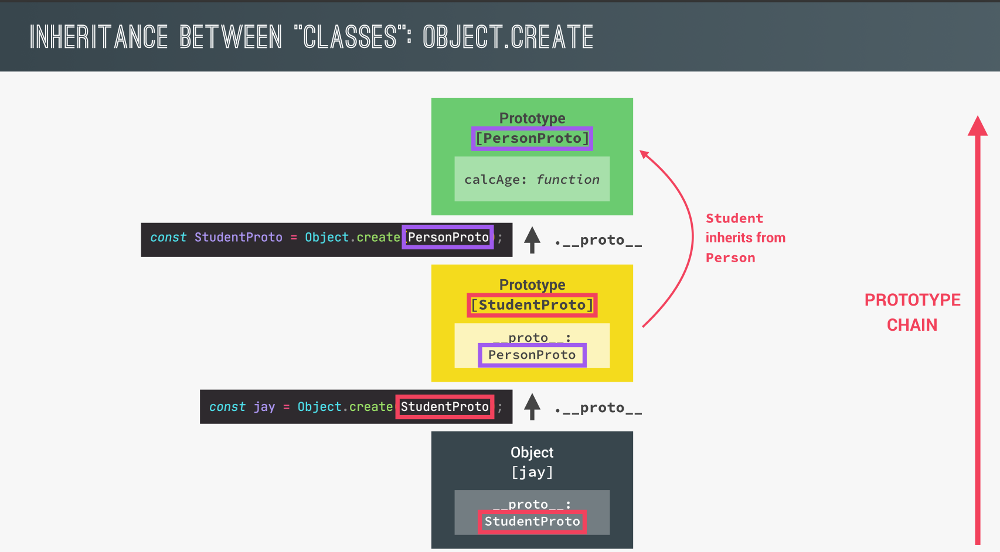

## Inheritance In Action

<p align="center">

</p>

## Inheritance With Constructor Function

### Before using inheritance (No inheritance between Person and Student)

```js
// Constructor function for the Person class
const Person = function (firstName, birthYear) {
  this.firstName = firstName;
  this.birthYear = birthYear;
};

// Adding a method to Person's prototype to calculate age
Person.prototype.calcAge = function () {
  console.log(2037 - this.birthYear); // Calculates age based on birth year
};

// Constructor function for the Student class
const Student = function (firstName, birthYear, course) {
  // Repeating properties for firstName and birthYear
  this.firstName = firstName; // This duplicates the properties from the Person constructor
  this.birthYear = birthYear; // Duplication should be avoided by inheriting from Person
  this.course = course;
};

// Adding a method to Student's prototype to introduce the student
Student.prototype.introduce = function () {
  console.log(`My name is ${this.firstName} and I study ${this.course}`); // Custom method for Student
};

// Creating a new Student instance without inheritance from Person
const mike = new Student("Mike", 2020, "Computer Science");

// Calling the introduce method from Student prototype
mike.introduce(); // Output: My name is Mike and I study Computer Science

// Note: Since there is no inheritance, Student doesn't have access to Person's methods, like calcAge.
```

### How make inheritance

<p align="center">

</p>

```js
child.prototype = Object.create(Parent.prototype);
```

### Bad way and best way to make inheritance:

<p align="center">

</p>

### After make inheritance

```js
// Constructor function for the Person class (Parent class)
const Person = function (firstName, birthYear) {
  this.firstName = firstName;
  this.birthYear = birthYear;
};

// Adding a method to Person's prototype to calculate age
Person.prototype.calcAge = function () {
  console.log(2037 - this.birthYear); // Calculates the age based on birthYear
};

// Constructor function for the Student class (Child class)
const Student = function (firstName, birthYear, course) {
  // 1) First change: Use Person constructor to inherit properties
  // Use 'Person.call' to ensure that firstName and birthYear are initialized
  // Person.call sets 'this' inside the Person constructor to the current Student instance
  Person.call(this, firstName, birthYear); // Inherit 'firstName' and 'birthYear' properties
  this.course = course; // Student-specific property
};

// 2) Second change: Set up inheritance using Object.create()
// Object.create sets the prototype of Student to a new object that has Person's prototype
Student.prototype = Object.create(Person.prototype);

// Adding a method specific to Student
Student.prototype.introduce = function () {
  console.log(`My name is ${this.firstName} and I study ${this.course}`);
};

// Ensure the constructor points to Student (not Person)
Student.prototype.constructor = Student; // Fix the constructor reference

// Creating an instance of Student
const mike = new Student("Mike", 2020, "Computer Science");

// Calling methods
mike.introduce(); // Output: My name is Mike and I study Computer Science
mike.calcAge(); // Output: 17 (2037 - 2020)
```

### How it is work

<p align="center">

</p>

```js
// === Inspecting the Prototype Chain ===

// Log mike's prototype
console.log(mike.__proto__);
// mike.__proto__ points to Student.prototype
// It will contain the introduce() method

// Log the prototype of mike.__proto__ (Person.prototype)
console.log(mike.__proto__.__proto__);
// mike.__proto__.__proto__ points to Person.prototype
// It will contain the calcAge() method and the constructor function (Person)

// === instanceof Operator ===

console.log(mike instanceof Student); // true
// 'mike' is an instance of Student because it was created by the Student constructor

console.log(mike instanceof Person); // true
// 'mike' is also an instance of Person because Student.prototype inherits from Person.prototype

// === Important Note ===
// Since we used Object.create(Person.prototype), the prototype chain links Student instances
// to the Person prototype, which is why 'mike' is considered an instance of both Student and Person.
```

## Inheritance between ES6 classes

```js
// ES6 Class representing a person
class PersonCl {
  constructor(firstName, birthYear) {
    this.firstName = firstName;
    this.birthYear = birthYear;
  }

  // Method added to the prototype to calculate age
  calcAge() {
    console.log(2037 - this.birthYear);
  }

  // Arrow function added as an instance method (will not be on the prototype)
  introduce = function () {
    console.log(`My name is ${this.firstName} and I study ${this.course}`);
  };
}

// ES6 Class representing a student that extends PersonCl
class StudentCl extends PersonCl {
  constructor(firstName, birthYear, course) {
    // Calls the parent class constructor (super) to initialize inherited properties
    // super() must be called before accessing 'this' in derived classes
    super(firstName, birthYear);
    this.course = course; // Adds a new property specific to the StudentCl class
  }
}

// Create a new student object
const zoomibe = new StudentCl("zoombie", 2003, "computer science");

// Call the method to calculate the age (inherited from PersonCl)
zoomibe.calcAge();

// Call the introduce method
zoomibe.introduce();
```

## Inheritance between Classes Object.create

<p align="center">

</p>

```js
// Define an object `PersonProto` with methods
const PersonProto = {
  // Method to calculate and print age based on birth year
  calcAge() {
    console.log(
      `Birth Year for ${this.firstName} is => ${2037 - this.birthYear}`
    );
  },

  // A method to initialize properties similar to a constructor function
  init(firstName, birthYear) {
    this.firstName = firstName;
    this.birthYear = birthYear;
  },
};

// Create `StudentProto` as an object that inherits from `PersonProto`
const StudentProto = Object.create(PersonProto);

// Redefine the `init` method for `StudentProto` to include `course`
// This will override the `init` method inherited from `PersonProto`
StudentProto.init = function (firstName, birthYear, course) {
  // Call the parent `init` method to initialize `firstName` and `birthYear`
  PersonProto.init.call(this, firstName, birthYear);
  // Add the `course` property specific to `StudentProto`
  this.course = course;
};

// Add an `introduce` method for students
StudentProto.introduce = function () {
  console.log(
    `Your name is ${this.firstName} and Your Education is ${this.course}`
  );
};

// Create an object `zoombie` from `StudentProto` using `Object.create`
const zoombie = Object.create(StudentProto);

// Initialize the `zoombie` object with the `init` method from `StudentProto`
zoombie.init("zoombie", 2003, "information system");

// Call the method to calculate age (inherited from `PersonProto`)
zoombie.calcAge();

// Call the `introduce` method (defined on `StudentProto`)
zoombie.introduce();
```
