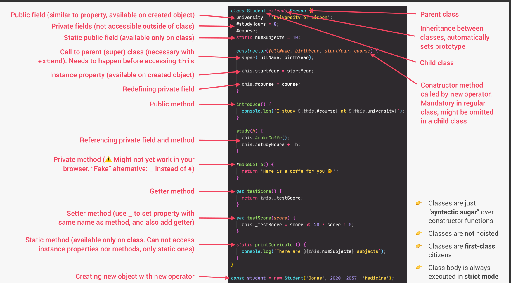

## Example With Classes

```js
// ================================= [Class with Encapsulation for Data Privacy and Protection] =================================

// Public Fields
// Private Fields
// Public Methods
// Private Methods

class Account {
  // 1) Public Fields (accessible from outside the class)
  locale = navigator.language; // Locale is public, can be accessed directly

  // 2) Private Fields (only accessible within the class)
  #movements = []; // Movements are private to protect the transaction history
  #pin; // Pin is private to protect account security

  constructor(owner, currency, pin) {
    // Public fields (owner and currency) can be accessed outside the class
    this.owner = owner;
    this.currency = currency;

    // Protected Property (conventionally protected by prefixing with an underscore)
    this._pin = pin; // This pin is protected and can be accessed with caution inside the class

    console.log(`Thanks for opening your account, ${this.owner}`);
  }

  // 3) Public Methods (accessible from outside the class)

  // Get account movements (public method)
  getMovements() {
    return this.#movements; // Returns the private array of movements
  }

  // Deposit money into the account
  deposit(val) {
    this.#movements.push(val); // Adds deposit to movements
    return this; // Enables method chaining by returning the object itself
  }

  // Withdraw money from the account
  withdraw(val) {
    this.deposit(-val); // Withdraw is the negative value of deposit
    return this; // Enables method chaining
  }

  // Request a loan
  requestLoan(val) {
    // Loan is approved using private method #approveLoan
    if (this.#approveLoan(val)) {
      this.deposit(val); // If approved, add loan amount as deposit
      console.log(`Loan approved`);
    }
    return this; // Enables method chaining
  }

  // 4) Private Methods (only accessible within the class)

  // Approve a loan (private method)
  #approveLoan(val) {
    return true; // Simple logic for loan approval
  }
}

// Creating an instance of Account
const zoombie = new Account("Zoombie", "EUR", 2111);

// Perform transactions
zoombie.deposit(34);
zoombie.withdraw(3535);
zoombie.requestLoan(3222);

// Trying to access private property will result in an error
// console.log(zoombie.#movements); // Error: Cannot access private field

// Output the account object
console.log(zoombie);

// Chaining methods
// These methods return 'this', allowing us to chain calls
zoombie
  .deposit(34)
  .deposit(23)
  .requestLoan(4958)
  .withdraw(33834)
  .withdraw(3923);

// This chaining works because each method call returns the 'this' object, allowing continued method calls on the same instance.
```

## ES6 Classes Summary

<p align="center">

</p>
