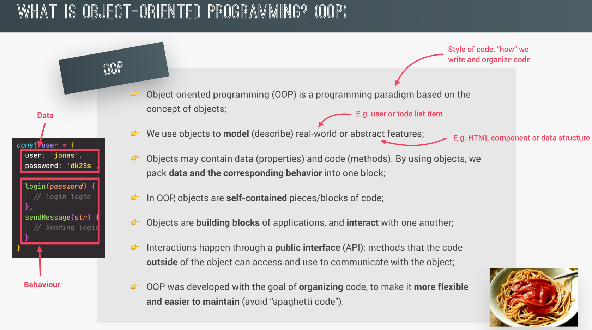

## OOP

<p align="center">
  
</p>

## OOP Principles

- **`Abstraction`**

  Ignoring or hiding details that don't matter, allowing us to get an overview prespective of the thing we're implementing. instead of messing with details that don't realy matter to our implementation.

  ```java
  // Abstract class
    abstract class Animal {
        // Abstract method (no implementation here)
        abstract void makeSound();

        // Regular method (implemented)
        public void sleep() {
            System.out.println("The animal is sleeping");
        }
    }

    // Dog class inherits from Animal
    class Dog extends Animal {
        // Provide implementation for the abstract method
        public void makeSound() {
            System.out.println("The dog barks");
        }
    }

    // Main class
    public class Main {
        public static void main(String[] args) {
            // Create a Dog object (an instance of the Dog class)
            Animal myDog = new Dog();  // Abstraction in action
            myDog.makeSound();  // Calls the implemented method
            myDog.sleep();      // Calls the non-abstract method
        }
    }

  ```

  **Abstraction**: In the main method, we create an instance of Dog but reference it as an Animal. This abstracts away the details of the specific animal, focusing

- **`Encapsulation`**

  Keeping properties and methods private inside the class, so they are not accessible from outside the class.
  Some methods can be exposed as a public interface(API).

  ```java
  // Class demonstrating encapsulation
    class Person {
        // Private fields (data is hidden)
        private String name;
        private int age;

        // Public getter for the name
        public String getName() {
            return name;
        }

        // Public setter for the name
        public void setName(String name) {
            this.name = name;
        }

        // Public getter for the age
        public int getAge() {
            return age;
        }

        // Public setter for the age
        public void setAge(int age) {
            if(age > 0) { // Simple validation
                this.age = age;
            } else {
                System.out.println("Age must be positive");
            }
        }
    }

    // Main class
    public class Main {
        public static void main(String[] args) {
            // Create a Person object
            Person person = new Person();

            // Set values using setter methods
            person.setName("John");
            person.setAge(25);

            // Get values using getter methods
            System.out.println("Name: " + person.getName());
            System.out.println("Age: " + person.getAge());
        }
    }

  ```

  This is **encapsulation** because the internal details (fields) are hidden, and external access is controlled through methods.

- **`Inheritance`**

  Making all properties and methods of a certain class available to a child class, forming a hierarchical relationship between classes. This allows us to reuse common logic to model real-world relationships.

  ```java
  // Parent class (Base class)
    class Animal {
        // Method in the parent class
        public void eat() {
            System.out.println("This animal is eating.");
        }
    }

    // Child class (Derived class)
    class Dog extends Animal {
        // Method specific to the child class
        public void bark() {
            System.out.println("The dog is barking.");
        }
    }

    // Main class
    public class Main {
        public static void main(String[] args) {
            // Create an object of the Dog class
            Dog myDog = new Dog();

            // Inherited method from Animal class
            myDog.eat();

            // Method specific to Dog class
            myDog.bark();
        }
    }

  ```

- **`Polymorphism`**

  Polymorphism in object-oriented programming (OOP) refers to the ability of different classes to be treated as instances of the same class through a common interface. It allows methods to do different things based on the object that it is acting upon, enabling flexibility and the ability to invoke the same method on different objects.

  **There are two types of polymorphism:**

  - Compile-time polymorphism (Method Overloading): Achieved by function overloading.
  - Run-time polymorphism (Method Overriding): Achieved through inheritance and interfaces.

  ```java
  // Parent class
    class Animal {
        // Method to be overridden
        public void makeSound() {
            System.out.println("Animal makes a sound");
        }
    }

    // Child class Dog
    class Dog extends Animal {
        @Override
        public void makeSound() {
            System.out.println("Dog barks");
        }
    }

    // Child class Cat
    class Cat extends Animal {
        @Override
        public void makeSound() {
            System.out.println("Cat meows");
        }
    }

    // Main class
    public class Main {
        public static void main(String[] args) {
            // Creating references of Animal type
            Animal myDog = new Dog();
            Animal myCat = new Cat();

            // Calling the overridden method
            myDog.makeSound(); // Outputs: Dog barks
            myCat.makeSound(); // Outputs: Cat meows
        }
    }
  ```
