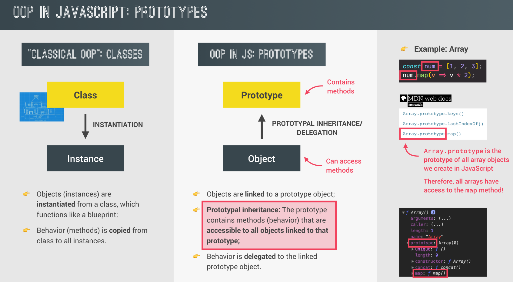
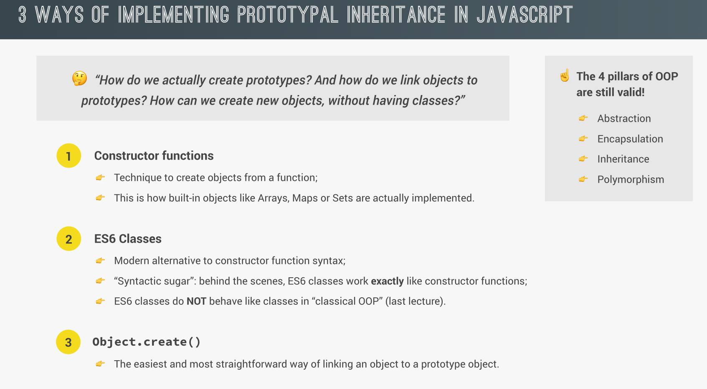
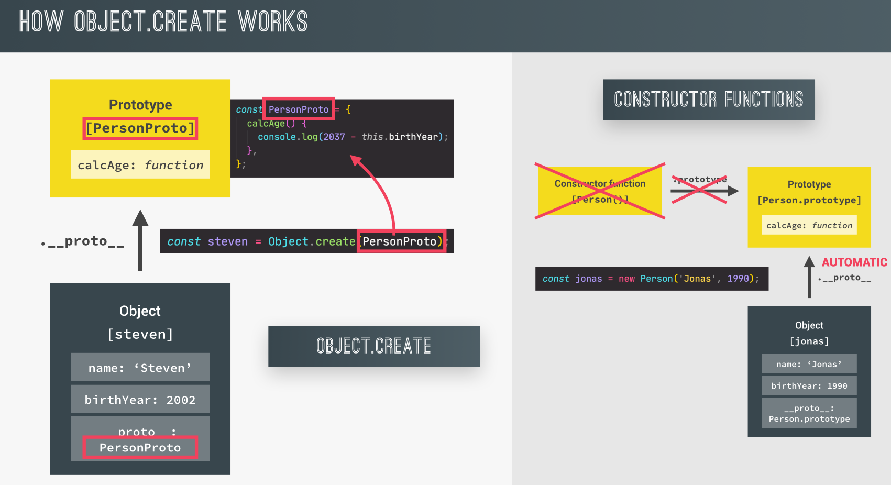
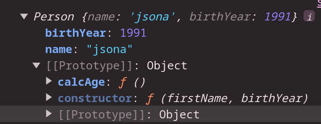
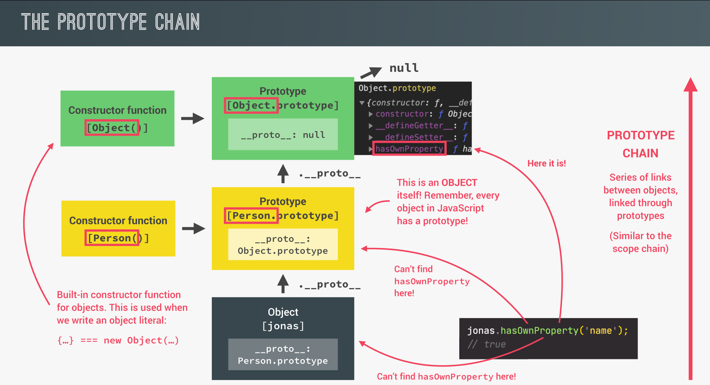

## OOP In JavaScript: Prototypes

First, what is a prototype in general?

A prototype in JavaScript is a special object that is associated with every JavaScript object. It allows objects to share methods and properties, which can be reused among different instances.

<p align="center">
  
</p>

## Ways of implementing prototypal inheritance in js

<p align="center">
  
</p>

- **`Constructor Function`**

  ```js
  // Constructor Function
  const Person = function (firstName, birthYear) {
    console.log(this); // Person{}

    // Instance Properties
    this.name = firstName;
    this.birthYear = birthYear;

    // Never do this because if you create millions of objects,
    // each object will copy this function, which is a bad practice
    //   this.calcAge = function () {
    //     console.log("this from calcAge: ", this);
    //     return 2024 - birthYear;
    //   };
  };
  // 1. A new {} is created
  // 2. The function is called, with this = {}
  // 3. {} is linked to the prototype
  // 4. The function automatically returns {}

  // These steps occur when you use a constructor function like this:
  const user = new Person("jsona", 1991);

  // Adding a method to the prototype
  Person.prototype.calcAge = function () {
    return 2023 - this.birthYear;
  };
  console.log(user);

  // For this check, if zoombie is an instance of Person's prototype, or if name is not in the prototype.
  console.log(user instanceof Person);
  ```

- **`ES6 Classes`**

  1. Classes are NOT hoisted
  2. Classes are first-class citizes
  3. Classes are executed in strict mode

  In JavaScript, classes are syntactical sugar over the existing prototype-based inheritance. When you define a class using the class syntax, methods (including getters and setters) you define are added to the class's prototype.

  **Class declaration**

  ```js
  class PersonCl {
    constructor(firstName, birthYear) {
      this.firstName = firstName;
      this.birthYear = birthYear;
    }
    // This method is added to the prototype
    calcAge() {
      console.log(2037 - this.birthYear);
    }
  }
  const jessica = new PersonCl("Jessica", 1996);

  // If you try to check the prototype of `jessica` and the prototype of `PersonCl`, you will find that they are equal.

  console.log(jessica.__proto__ === PersonCl.prototype);
  ```

  **Class expression**

  ```js
  const PersonCl = class {};
  ```

- **`Object.create()`**

  ```js
  // Define an object `PersonProto` with methods
  const PersonProto = {
    // Method to calculate and print age based on birth year
    calcAge() {
      console.log(`Birth Year for ${this.name} is => ${2037 - this.birthYear}`);
    },

    // A method to initialize properties similar to a constructor function
    init(firstName, birthYear) {
      this.firstName = firstName;
      this.birthYear = birthYear;
    },
  };

  // Creating a new object `zoombie` that inherits from `PersonProto`
  const zoombie = Object.create(PersonProto);

  // Directly assigning properties to the `zoombie` object
  zoombie.name = "zoombie";
  zoombie.birthYear = 2003;

  // Call the calcAge method, which calculates and logs the birth year based on 2037
  console.log(zoombie.calcAge()); // Outputs: Birth Year for zoombie is => 34

  // Log the `zoombie` object to inspect its properties
  console.log(zoombie);

  // Check if the prototype of `zoombie` is `PersonProto`
  console.log(zoombie.__proto__ === PersonProto); // Outputs: true
  ```

## How Object.create() works

<p align="center">
  
</p>

## Prototypes

When you print this user object, you'll find that calcAge is in the prototype, not in the object itself.

<p align="center">

</p>

- Prototype Method

  ```js
  // Prototype method

  Person.prototype.calcAge = function () {
    console.log("this from calcAge: ", this);
    return 2024 - birthYear;
  };
  console.log(user.__proto__); // Person.prototype

  console.log(user.__proto__ === Person.prototype); //true
  console.log(Person.isPrototypeOf(user)); //true
  console.log(Person.prototype.isPrototypeOf(Person)); // false
  ```

- Prototype property

  ```js
  // Prototype property
  Person.prototype.gender = "Male";

  console.log(user.hasOwnProperty("gender")); //false
  console.log(user.hasOwnProperty("birthYear")); //true
  ```

## Prototypal Inheritance

  <p align="center">
  
</p>

When you look at this object, you get the `jonas` object that calls the `calcAge()` function. When it is called, JavaScript first searches for this method in the object itself (which was created using the constructor function `Person`). If it doesn't find the method there, it will then search in the `prototypes` that was inherited during the object's creation.

## Prototype Chain(like scope chaining)

<p align="center">

</p>

Person inherits the prototype of Object, and jonas inherits the prototype of Person (which includes both the Person prototype and the prototype of Object).

When you first look at the object, you can see the hierarchy because every object has its own prototype.

At the start, Person is an object, and jonas is an instance of Person.

Object (with its own prototype, which is empty) ---> Person (with its own prototype, which you define in the code) ---> jonas (inherits the prototype from the object it was created from)."

```js
// get all prototypes for Person(Person.prototype)
console.log(jonas.__proto__);
// Object.prototype (top of prototype chain)
console.log(jonas.__proto__.__proto);
// null
console.log(jonas.__proto__.__proto__proto);
```

**Prototypes in Array**

```js
const arr = [3, 55, 3, 3, 34, 45, 5, 6];
console.log(arr.__proto); // Get all methods that are used with arrays.
console.log(arr.__proto__.__proto__); // Object.prototype

// Create your own function as a prototype method for arrays.
Array.prototype.unique = function () {
  return [...new Set(this)];
};

console.log(arr.unique());
```

## Setter and Getter

```js
class PersonCl {
  constructor(firstName, birthYear) {
    this.firstName = firstName;
    this.birthYear = birthYear;
  }
  // This method calculates the age based on the birthYear property
  // It's a regular method and is added to the prototype
  calcAge() {
    console.log(2037 - this.birthYear);
  }

  // Getter for 'age'
  // This is a property, not a method. It computes the age dynamically based on the birthYear
  get age() {
    return 2037 - this.birthYear; // Returns the calculated age
  }

  // Setter for 'name'
  // This is also a property. It allows you to set the firstName using an intuitive syntax
  set name(firstName) {
    this.firstName = firstName;
  }

  // Getter for 'name'
  // This is a property that retrieves the value of the firstName
  get name() {
    return this.firstName;
  }
}

// Creating an instance of PersonCl
const jessica = new PersonCl("Jessica", 1996);

// Accessing the 'age' property through the getter
console.log(jessica.age); // Output: 41 (calculated based on the birthYear)
```

## Static Methods

Static methods are functions that belong to the class itself rather than any specific instance of the class. They are called on the class directly and are often used for utility functions that do not depend on instance-specific data.

**Built-in Static Methods**

```js
Array.from();

Number.parseFloat();
```

**Custom Static Method Example**

```js
class Person {
  static hey() {
    console.log("Hello from static method");
  }
}

// Calling the static method
Person.hey(); // Output: Hello from static method
```
