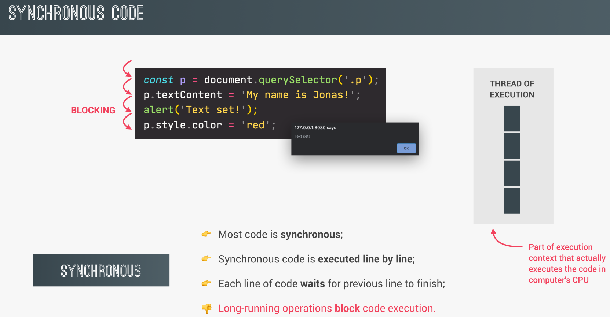
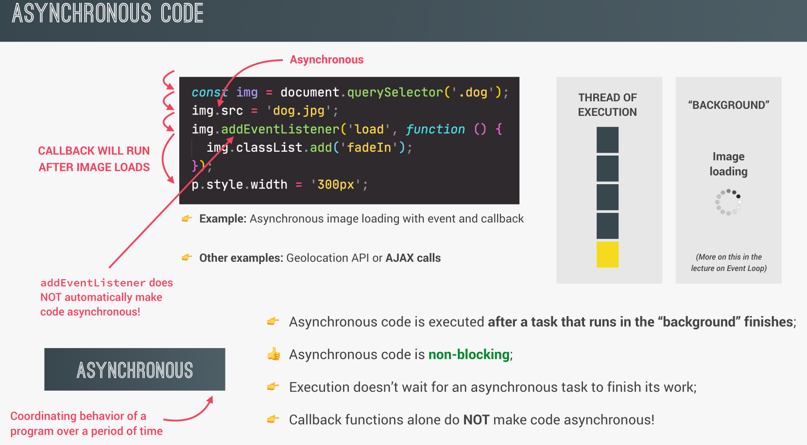
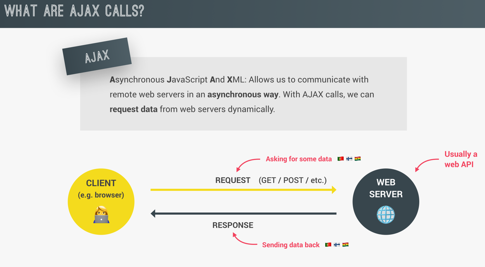
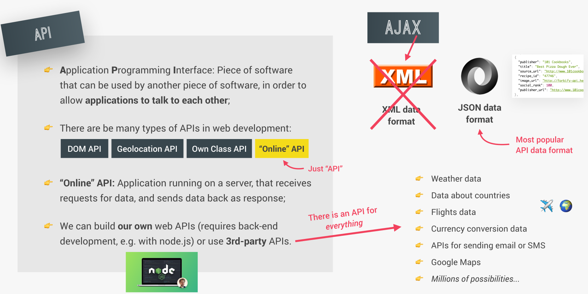
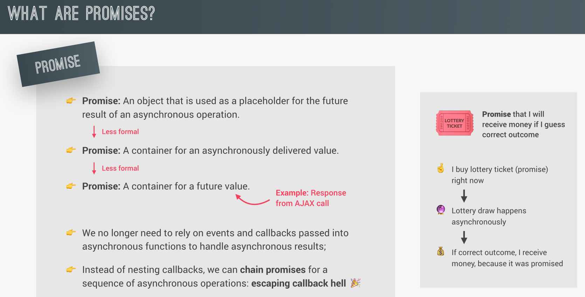
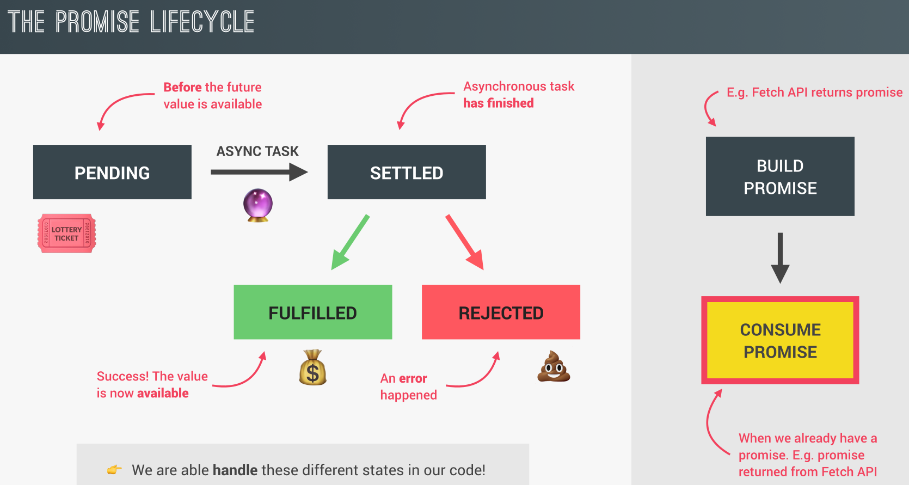

## Synchronous

<p align="center">

</p>

## ASynchronous

<p align="center">

</p>

## What is a Ajax(`Asynchronous JavaScript and XML`)?

<p align="center">

</p>

## What is a API?

<p align="center">

</p>

- XML file(Soap)

  ```js
  <books>
    <book>
      <title>Clean Code</title>
      <author>Robert C. Martin</author>
      <year>2008</year>
    </book>
  </books>
  ```

- JSON file(REST)

  ```js
  {
  "books": [
    {
      "title": "Clean Code",
      "author": "Robert C. Martin",
      "year": 2008
    },

  ]
  }
  ```

## Promises

<p align="center">

</p>

## The Promises Lifecycle

<p align="center">

</p>

- `then()`: Runs if the promise is resolved (successful fetch).
- `catch()`: Runs if the promise is rejected (fetch failed).
- `finally()`: Runs after the promise is settled, whether resolved or rejected. It executes clean-up actions or any code that needs to run regardless of success or failure.

## Promises Examples

- `Example 1 => Simple Promise Example `

  ```js
  const lotteryPromise = new Promise(function (resolve, reject) {
    console.log("Lotter draw is happening");
    setTimeout(function () {
      if (Math.random() >= 0.5) resolve("You Win!");
      else reject("You lost your money");
    }, 2000);
  });
  lotteryPromise
    .then((res) => console.log(res))
    .catch((err) => console.error(err));
  ```

- `Example 2`

  **Problem**

  ```js
  // Callback Hell
  setTimeout(() => {
    console.log("I waited for 1 second");
    setTimeout(() => {
      console.log("I waited for 2 seconds");
      setTimeout(() => {
        console.log("I waited for 3 seconds");
        setTimeout(() => {
          console.log("I waited for 4 seconds");
        }, 4);
      }, 3);
    }, 2);
  }, 1);
  ```

  **Solution**

  ```js
  // Power of using promises
  const wait = function (seconds) {
    return new Promise((resolve) => {
      setTimeout(resolve, seconds * 1000);
    });
  };

  wait(2)
    .then(() => {
      console.log("I waited for 2 seconds");
      return wait(3);
    })
    .then(() => {
      console.log("I waited for 3 seconds");
      return wait(4);
    })
    .then(() => {
      console.log("I waited for 4 seconds");
    });
  ```

## Consuming Promises With AsyncAwait

```js
const getPosition = function () {
  return new Promise(function (resolve, reject) {
    navigator.geolocation.getCurrentPosition(resolve, reject);
  });
};
const whereAmI = async function (country) {
  // get position first
  const pos = await getPosition();
  // get the coords
  const { latitude: lat, longitude: lng } = pos.coords;
  const dataGeo = await fetch(`http://geocode.xyz/${lat},${lng}?geoit=json`);
  // this part not wait as async code but work as async code
  const res = await fetch(
    `https://restcountries.com/v3.1/name/${dataGeo.country}`
  );
  const data = await res.json();
  console.log(data);
};

whereAmI();
```

## Handling Errors With AsyncAwait

A try...catch block is used in JavaScript to handle errors in a controlled way.

- **`try block`**: Contains the code that may throw an error. If no error occurs, the code runs normally.
- **`catch block`**: Executes if an error is thrown in the try block. It catches the error and allows you to handle it (e.g., by logging it or providing a fallback).

### WhereAmI Function

```js
const getPosition = function () {
  return new Promise(function (resolve, reject) {
    navigator.geolocation.getCurrentPosition(resolve, reject);
  });
};

const whereAmI = async function (country) {
  try {
    // get position first
    const pos = await getPosition();

    // get the coords
    console.log(pos);
    const { latitude: lat, longitude: lng } = pos.coords;
    console.log(lat, " ", lng);

    // fetch geocode data
    const res = await fetch(`http://geocode.xyz/${lat},${lng}?geoit=json`);
    if (!res.ok) throw new Error("Failed to fetch geocode data");

    // await the JSON response
    const dataGeo = await res.json();
    console.log(dataGeo);

    // ensure dataGeo has a country field
    if (!dataGeo.country)
      throw new Error("Country not found in geocode response");

    // fetch country data based on geocode response
    const res2 = await fetch(
      `https://restcountries.com/v3.1/name/${dataGeo.country}`
    );
    if (!res2.ok) throw new Error("Failed to fetch country data");

    // await the JSON response
    const data = await res2.json();
    console.log(data);

    return `You are in ${dataGeo.city}`;
  } catch (err) {
    console.error(err);
    // throw err;
  }
};

whereAmI();
whereAmI();
whereAmI();
whereAmI();
// =====> After making multiple calls, this issue will occur:
// The issue occurs because geocode.xyz has a rate limit on API requests. When you call whereAmI() multiple times in quick succession, you're likely exceeding this rate limit, which results in an error (e.g., 429 Too Many Requests or similar).
```

## When entering the try or catch block, it does not depend on status codes

The status codes that do not automatically trigger the catch block are those considered successful HTTP responses (status codes in the range 200–299). For example, 200 OK or 204 No Content. These codes indicate that the request was successful, so they won’t cause a fetch call to throw an error.

The status codes like 404 (Not Found) or 500 (Internal Server Error) will not automatically trigger the catch block either unless you explicitly check for them. Fetch only throws an error for network issues (like no internet connection), but non-2xx status codes still require manual handling with a check like res.ok.

## Returning Values from Async Fucntions

[Reuse this code](#whereami-function)

```js
console.log("1: Will Get Location");
whereAmI();
console.log("2: Finished getting location");

// ouput:
// 1: Will Get Location
// 2: Finished getting location
// 3: execute the function
```

**If you want to execute the function between these two logs, how do you do it?**

```js
// if tring to do this
console.log("1: Will get location");
const city = whereAmI();
console.log(city);
console.log("3: Finished getting location");

// ouput
// 1: Will get location
// Promise {<pending>}
// 3: Finished getting location

// Hint: This not return value but return Promise<pending>
```

**code to return value**

```js
// "Try this: if you want to enter the catch block without returning a value, the solution is to add `throw err` to the code."
console.log("1: Will get location");
whereAmI()
  .then((city) => console.log(`2: ${city}`))
  .catch((err) => console.log(`2: ${err.message}`))
  .finally(() => {
    console.log("3: Finished getting location");
  });

// using immediately invoked function expression (IIFE)(that is called one time)
(async function () {
  try {
    const city = await whereAmI();
    console.log(`1: ${city}`);
  } catch (err) {
    console.error(`2: ${err.message}`);
  }
  console.log("3: Finished getting location");
})();
```
