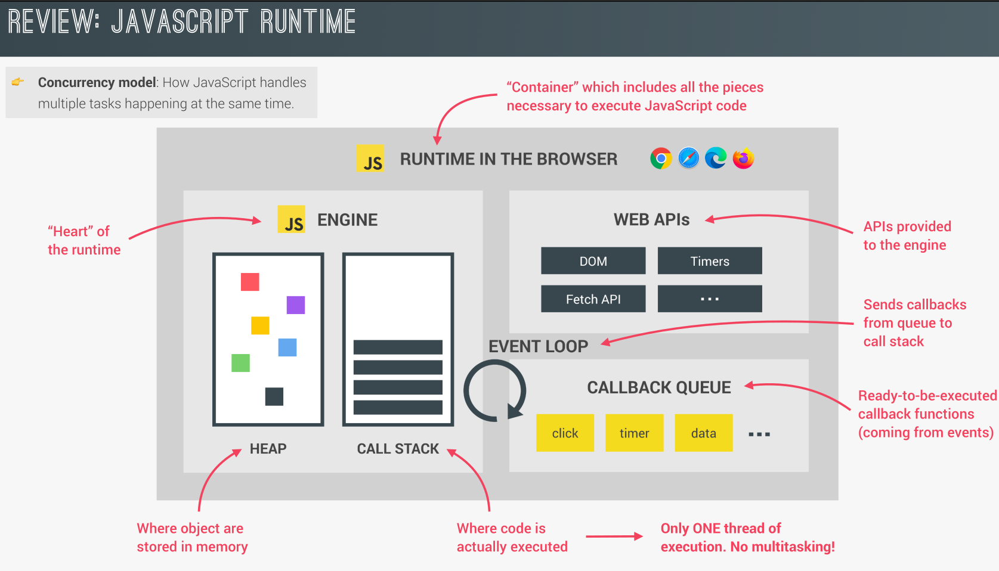
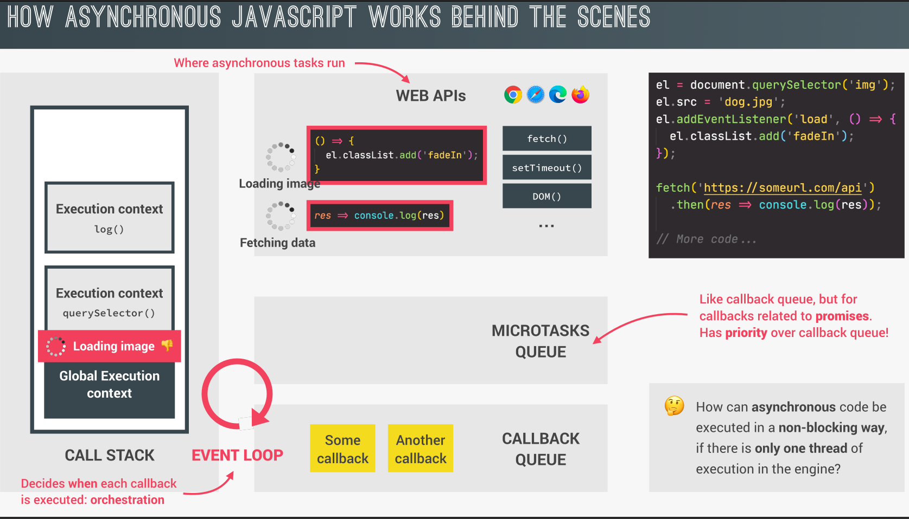

## JavaScript Engine

<p align="center">
  
</p>

- **`JS Engine`**: A JavaScript engine is a program that executes JavaScript code. The most popular engines include V8 (used by Chrome and Node.js) and SpiderMonkey (used by Firefox). It compiles JavaScript into machine code for faster execution.

- **`Heap`**: The heap is a region in memory where objects, variables, and functions are dynamically allocated. It stores data that doesn’t have a fixed size or is needed beyond the function’s execution scope.

- **`Call Stack`**: The call stack is a data structure that tracks the function calls in JavaScript. It works in a LIFO (Last In, First Out) manner, where each new function call is "pushed" onto the stack, and when it's done, it is "popped" off.

- **`Web APIs`**: These are APIs provided by the browser (or environment) that allow JavaScript to interact with features like the DOM, timers (setTimeout), AJAX, and more. They are not part of the JS engine but are available for JS to use in a browser.

- **`Event Loop`**: The event loop is a mechanism that ensures the non-blocking behavior of JavaScript. It checks the call stack and the callback queue, moving tasks from the queue to the stack when the stack is empty, allowing asynchronous functions to run.

- **`Callback Queue`**: The callback queue holds asynchronous callbacks (like those from setTimeout, etc.) that are waiting to be executed. The event loop moves these callbacks to the call stack when it's empty.

## How Asynchronous JavaScript Works Behind The Scenes

<p align="center">
  
</p>

```js
// Synchronous: Select the  element from the DOM and assign it to 'el'
el = document.querySelector("img");

// Synchronous: Set the image source to "dog.png", but the loading happens asynchronously in the background
el.src = "dog.png";

// Asynchronous(Callback Queue): Add an event listener for when the image is fully loaded
// This does not block the execution and will execute the callback function later when the image is loaded
el.addEventListener("load", () => {
  // Asynchronous(Callback Queue): Once the image is loaded, the callback runs and adds the "fadeIn" class to the element
  el.classList.add("fadeIn");
});

// Asynchronous(Microtasks Queue): Fetch request starts in the background, allowing the next code to run immediately
fetch("https://someurl.com/api").then((res) => console.log(res));

// More code
```

## The difference between microtasks and tasks queues

- **Microtasks Queue**:

  - Higher priority than tasks.
  - Includes things like Promise callbacks.
  - After each task completes, all pending microtasks are executed before the event loop moves on to the next task.
  - Runs to completion: the event loop will clear the entire microtasks queue before proceeding.

- **Tasks Queue**:

  - Includes things like setTimeout, setInterval, and I/O events.
  - These are executed after microtasks and in between rendering updates.
  - The event loop moves to the next task only after handling the current microtasks queue.

**`Examples`**

```js
// Example #1
console.log("test start");
setTimeout(() => {
  console.log("from setTimeout");
}, 0);
Promise.resolve("Resolve promise 1").then((res) => console.log(res));
console.log("test end");

// Ouput:
// test start
// test end
// Resolve promise 1 ==> from Microtask Queue
// from setTimeout   ==> from Task Queue
```

```js
// Example #2
console.log("test start");
setTimeout(() => {
  console.log("from setTimeout");
}, 0);
Promise.resolve("Resolve promise 1").then((res) => console.log(res));

Promise.resolve(() => {
  for (let i = 0; i < 10000000000; i++) {}
}).then((res) => console.log("Resolve promise 2"));
console.log("test end");

// Ouput:
// test start
// test end
// Resolve promise 1 ==> from Microtask Queue
// Resolve promise 2 ==> from Mirotask Queue
// from setTimeout   ==> from Task Queue
```
