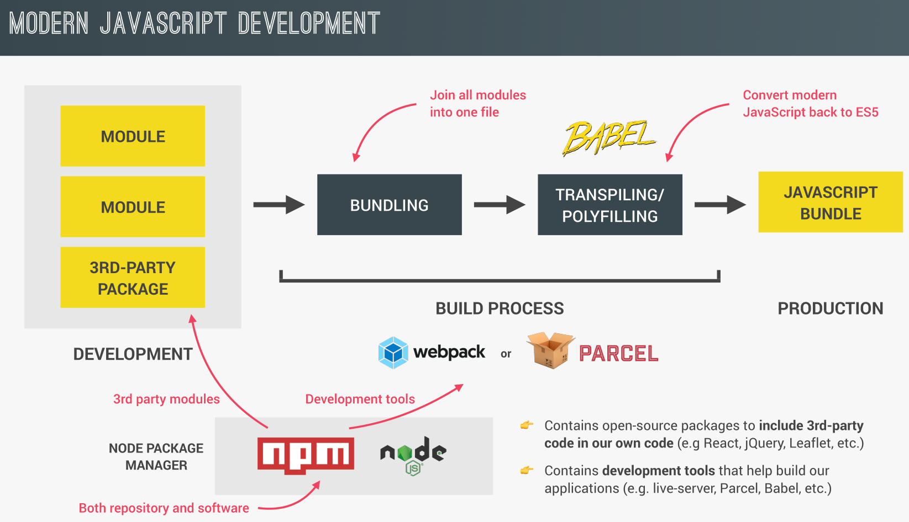
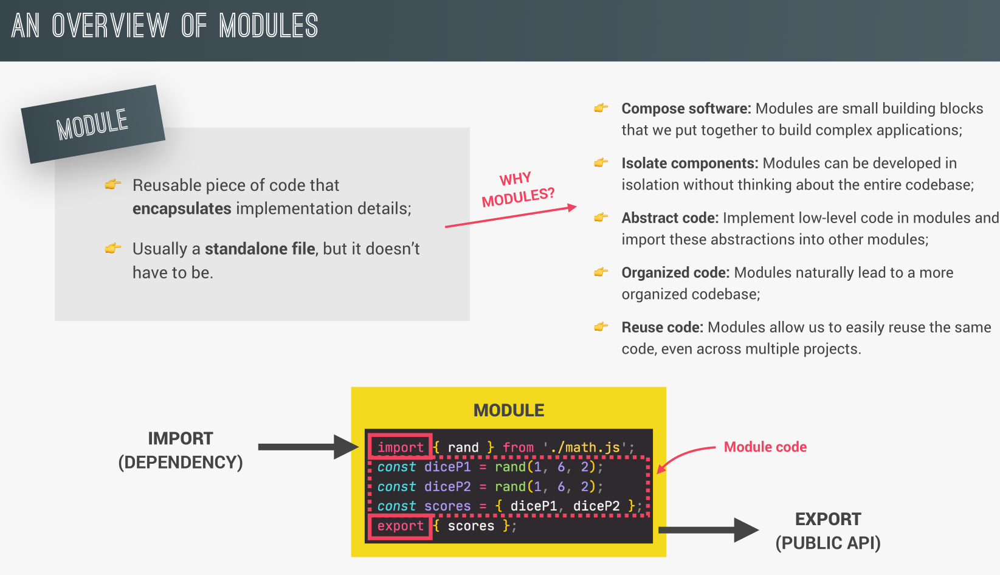
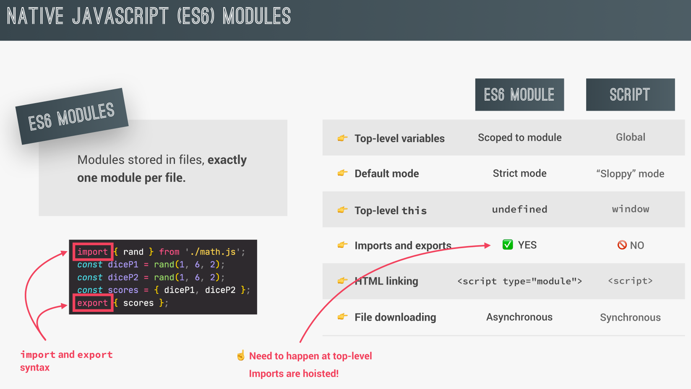
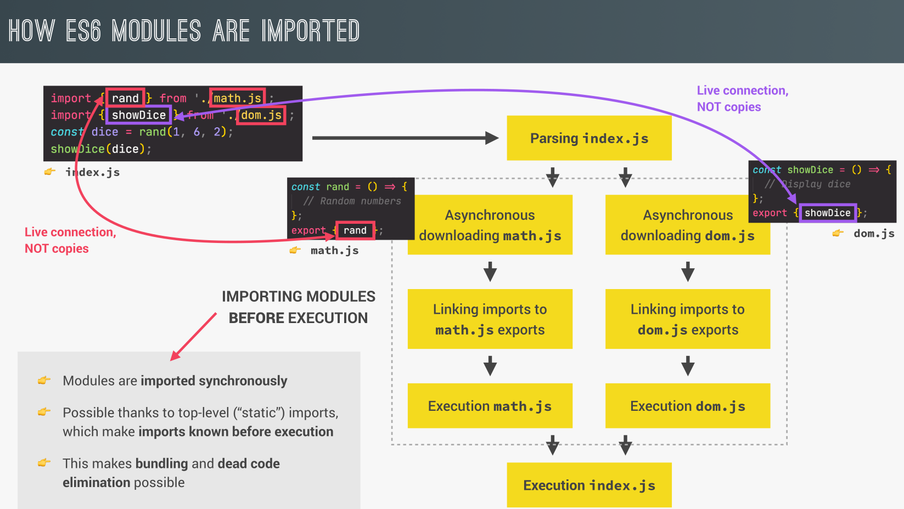

## overview of modern JS

  

- **Bundling**

  bundling refers to the process of combining multiple JavaScript files (and potentially other resources like CSS, images, etc.) into a single file or a few files. This technique is used to optimize web applications by reducing the number of HTTP requests needed to load the app and managing dependencies in a more efficient way.

- **Transpiling**

  JavaScript, transpiling is the process of converting code written in one version or dialect of JavaScript (or another language entirely) into a version that can be understood by older browsers or environments. This allows developers to write code using the latest JavaScript features while ensuring compatibility with environments that may not support them.

## Overview Of Modules

  

## ES6 Modules Vs. Script

  

- **`Top Level Variables`**

  **Top-level variables** in JavaScript refer to variables that are declared in the highest scope of a program or script. These variables are not nested within any functions, classes, or blocks like if, for, etc. They exist at the top level of the code, either in the global scope (for scripts) or within the module scope (for modules).

  **What is the difference between CommonJS and ES6 Modules?**

- **`Module Scope`**

  - CommonJS:

    Variables and functions declared in a CommonJS module are scoped to that module, meaning they won’t be available globally unless explicitly exported.

  - ESM:

    ES Modules also have their own scope, but they are more strictly scoped than CommonJS, and they also support static analysis due to their design, meaning the structure of the module (what's imported and exported) is known at compile time.

## How ES6 modules are imported?

  

**Why is importing synchronous and not asynchronous**

- Ensure predictable behavior: Since imports are resolved before any code runs, there are no surprises like circular dependencies or missing modules during execution.
- Maintain consistency: This static, synchronous behavior ensures modules load in a predictable order, making the code more reliable.
