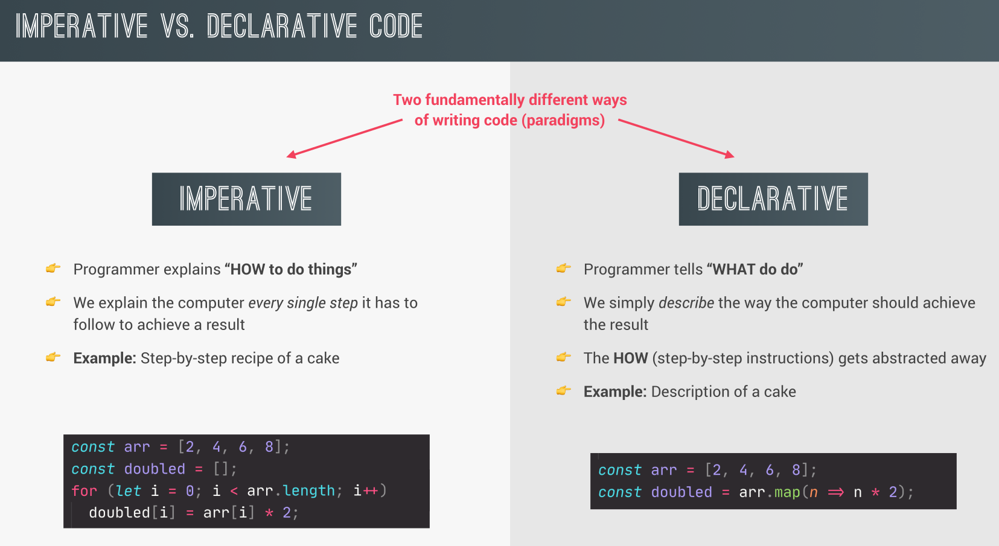
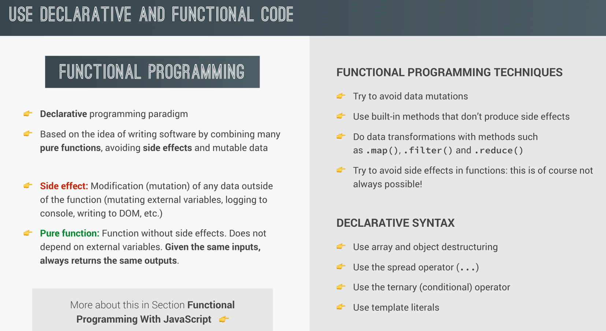

## The difference between imperative and declarative programming

<p align="center">
  
</p>

## What is functional programming, and how is it achieved?

<p align="center">
  
</p>

1.  **First-Class Functions**:

    Functions can be assigned to variables, passed as arguments, and returned from other functions.

    ```js
    const greet = (name) => `Hello, ${name}!`;
    const welcome = (fn, user) => fn(user);
    console.log(welcome(greet, "Alice")); // Output: Hello, Alice!
    ```

2.  **Higher-Order Functions**:

    Functions that take other functions as arguments or return them.

    ```js
    function applyFunction(func, value) {
      return func(value);
    }
    function square(x) {
      return x * x;
    }
    console.log(applyFunction(square, 5)); // Output: 25
    ```

3.  **Pure Functions**:
    Functions that always produce the same output for the same input and have no side effects.

    ```js
    add x y = x + y  -- Pure function
    ```
