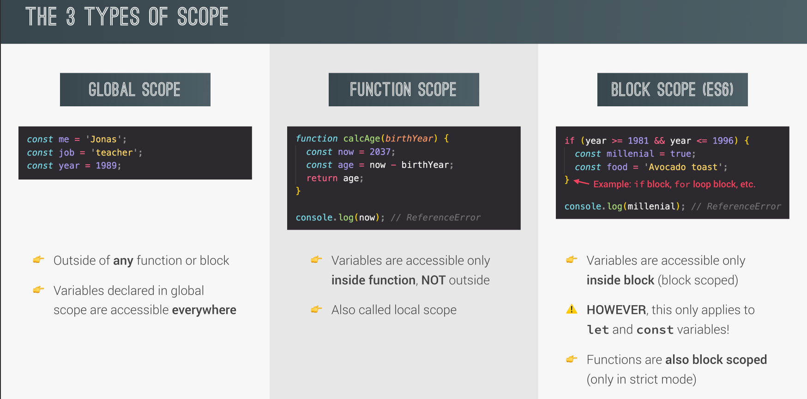
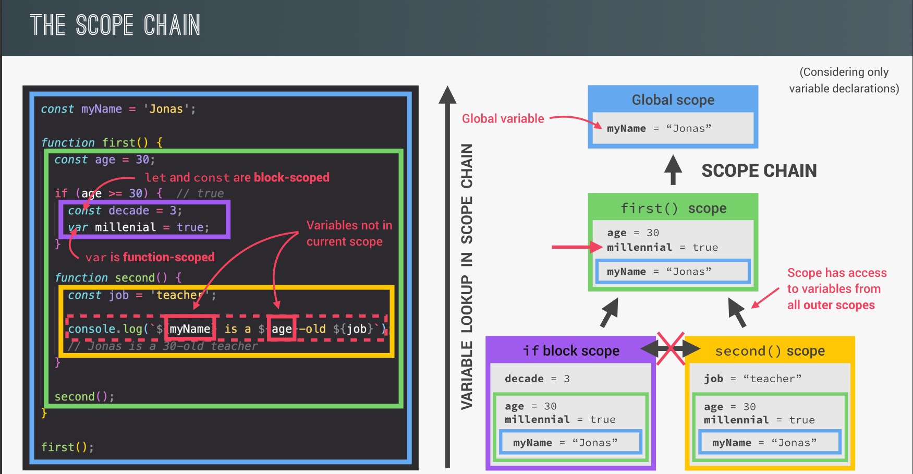
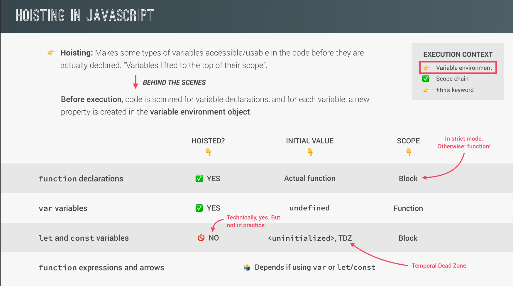
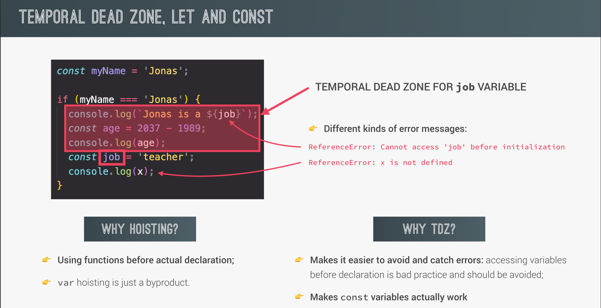

## Content of Execution Context

- Variable Environment
- Scope chain
- This keyword

## Some Definiations about Scoping

**`scope`** refers to the area or context in which variables and functions are accessible. It defines the visibility and lifetime of variables within the code.

**`Lexical Scoping`**
Scoping is controlled by placement of functions and blocks in the code.

**`Scope of a variabel`**
Region of our code where a certain variable can be accessed.

## The 3 Types of Scope

<p align="center">
  
</p>

---

## The Scope Chain

The scope chain is a mechanism in JavaScript that allows access to variables from the current scope and its parent scopes. It defines how the JavaScript engine resolves variable names during execution.

<p align="center">
  
</p>

---

## Hoisting

**`Hoisting`** allows variables and function declarations to be used before they are defined in the code.

<p align="center">
  
</p>

**Hoisting Examples**

```js
// Variables

console.log(me); //unidefined
console.log(job); // ReferenceError: can't access lexical declaration 'job' before initialization
console.log(year); // ReferenceError: can't access lexical declaration 'year' before initialization

var me = "zoombie";
let job = "Software Engineer";
const year = 2003;
```

```js
// Functions

console.log(addDel(2, 3)); // 5
console.log(addExpr(2, 3)); // ReferenceError: can't access lexical declaration 'addExpr' before initialization
console.log(addArrow(2, 3)); // ReferenceError: can't access lexical declaration 'addArrow' before initialization

function addDel(a, b) {
  return a + b;
}

const addExpr = function (a, b) {
  return a + b;
};
const addArrow = (a, b) => {
  return a + b;
};
```

## TDZ

<p align="center">
  
</p>

## The `this` Keyword in JavaScript

The `this` keyword in JavaScript refers to the **current execution context** in which the code is running. Its value depends on how and where the function is invoked. Here's how `this` behaves in different contexts:

1. **Global Execution Context**

   In the global scope, `this` refers to the **global object** (`window` in browsers, `global` in Node.js).
   Example:

   ```javascript
   console.log(this); // In the browser, this logs the `window` object.
   ```

2. **Function Execution Context**

   - In non-strict mode, when a function is called, `this` refers to the **global object** (if the function is called in the global scope).
   - In strict mode (`"use strict"`), `this` is `undefined` in a regular function call.

   Example (non-strict mode):

   ```javascript
   function show() {
     console.log(this); // Refers to the global object (window in browsers)
   }
   show();
   ```

   Example (strict mode):

   ```javascript
   "use strict";
   function show() {
     console.log(this); // `this` is undefined
   }
   show();
   ```

3. **Object Method Execution Context**

   When a method is called on an object, `this` refers to the **object** that owns the method.

   Example:

   ```javascript
   const person = {
     name: "Abdelrahman",
     greet() {
       console.log(this.name); // `this` refers to the `person` object
     },
   };
   person.greet(); // Output: "Abdelrahman"
   ```

4. **Constructor Function (New Binding)**

   In a constructor function (used with the `new` keyword), `this` refers to the **newly created object**.

   Example:

   ```javascript
   function Person(name) {
     this.name = name;
   }
   const person1 = new Person("Abdelrahman");
   console.log(person1.name); // Output: "Abdelrahman"
   ```

5. **Arrow Functions**

   In arrow functions, `this` is lexically bound, meaning it takes the value of `this` from the **surrounding execution context** where the arrow function is defined (not where it is invoked).

   Example:

   ```javascript
   const person = {
     name: "Abdelrahman",
     greet: () => {
       console.log(this.name); // `this` refers to the outer context, not the `person` object
     },
   };
   person.greet(); // Output: `undefined` (if in global scope)
   ```

## Regular Function Vs Arrow Function

**For `this` keyword**

```js
"use strict";
const jonas = {
  year: 2003,

  // Method defined in an object (jonas)
  calcAge: function () {
    console.log(this); // `this` refers to the `jonas` object
    console.log(2037 - this.year); // Accesses the year property of the `jonas` object using `this`

    // Arrow function inherits `this` from the parent (calcAge function)
    const greet = () => {
      console.log("From greet function : ", this); // `this` is still `jonas` because arrow functions inherit `this` from the surrounding context (calcAge)
    };

    // Regular function, `this` refers to the global object (window in non-strict mode)
    const print = function () {
      console.log("From print function : ", this); // `this` refers to the global object (Window) in non-strict mode
    };

    greet(); // Calls greet function, which uses `this` from the surrounding context (`jonas`)
    print(); // Calls print function, where `this` refers to the global object (Window)
  },

  // Arrow function as a method
  printThis: () => {
    console.log("From printThis function : ", this); // Arrow functions don't have their own `this`, so `this` refers to the surrounding context (global object in this case)
  },
};

jonas.calcAge(); // Calls calcAge, `this` refers to `jonas` object inside calcAge
jonas.printThis(); // Calls printThis, `this` refers to the global object (Window)
```

**For `Arguments` keywords**

```js
const addExpr = function (a, b) {
  console.log(arguments); // [2, 4, 6, 6]
  return a + b;
};
console.log(addExpr(2, 4, 6, 6));
console.log(arguments);
var addArrow = (a, b) => {
  console.log(arguments); // ReferenceError: arguments is not defined
  return a + b;
};

console.log(addArrow(2, 5)); // ReferenceError: arguments is not defined
```
