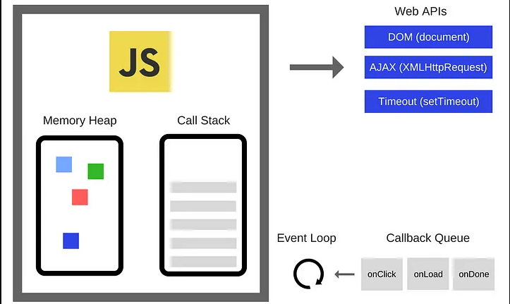
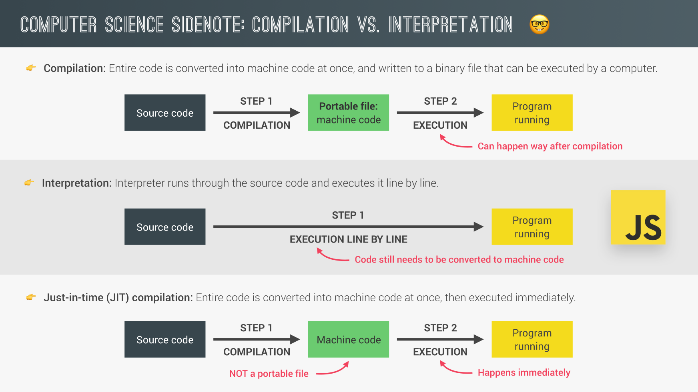
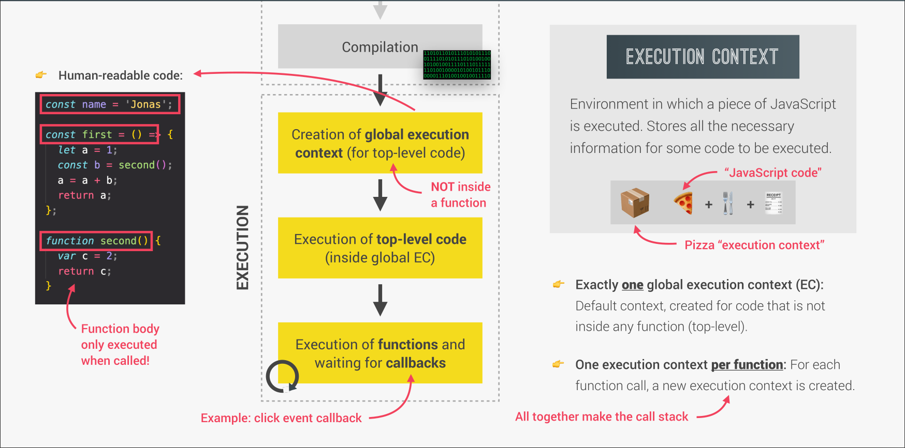
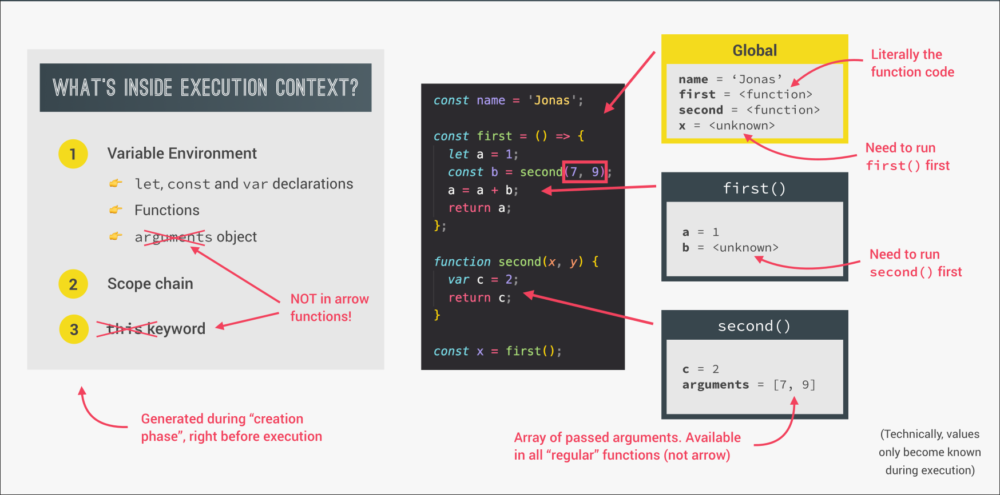
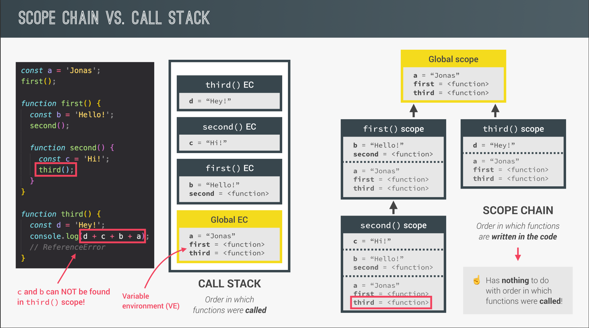

## JS engine

A program that executes JavaScript code, such as the V8 Engine, is referred to as a JavaScript engine.

**A JavaScript engine contains:**

- `Call Stack` This is where the code is executed in an ordered sequence, managing function calls and execution contexts.

- `Heap` This is a memory pool used for storing dynamic objects during the execution of the code.

<p align="center">
  
</p>

**Modren Just-In-Time compilation of Javascript**

1. Parsing

   The JavaScript engine reads the source code and breaks it down into tokens (lexical analysis), then creates an Abstract Syntax Tree (AST). This AST represents the structure of the code, which is easier for the engine to understand and optimize.

2. Compilation

   The JIT compiler converts the AST into machine code. Instead of interpreting the code line-by-line, the engine compiles the frequently used parts (hot code) into optimized machine code on the fly for faster execution.

3. Execution

   The compiled machine code is then executed. The JIT compiler continuously monitors performance, re-optimizing or de-optimizing code based on how it runs to ensure efficient execution.

## Compilation Vs Interpretation

<p align="center">
  
</p>

A **`portable`** file refers to a file that can be easily moved or transferred across different systems or platforms without requiring changes to its format or structure.

## JavaScript Runtime

In JavaScript, a runtime refers to the environment in which your JavaScript code is executed. It includes all the necessary components like memory management, event loops, and external APIs that the JavaScript code interacts with during execution.

**There are two main JavaScript runtimes:**

- **`Browser Runtime`**: JavaScript runs in web browsers (like Chrome, Firefox, etc.). This runtime includes features like the DOM (Document Object Model) to interact with web pages, setTimeout for timers, and other browser-specific APIs.

- **`Node.js Runtime`**: JavaScript also runs on servers using Node.js. This runtime provides access to the file system, network, and other low-level system operations, which are not available in a browser.

## Execution Context

An execution context is the environment in which JavaScript code is evaluated and executed. It contains all the information the JavaScript engine needs to run the code, as well as information about the code itself.

**There are two main types of execution contexts:**

1. Global Execution Context:

   - This is the default context where the JavaScript engine starts executing code.

   - Variables and functions declared outside of any function belong to this context.

   - It creates a global object (like window in browsers) and sets this to refer to
     that global object.

   Exactly one global execution context(EC):
   Default context, created for code that is not inside any function(top-level)

2. Function Execution Context:

   - Created whenever a function is invoked.

   - Each function call gets its own execution context.

   - The function's arguments, variables, and the value of this are part of this context.

<p align="center">
  
</p>

---

## Execution context in detail

<p align="center">
  
</p>

## Call Stack

**For this example, here is what happens during execution:**

```js
const name = "jonas";

const first = () => {
  let a = 1;
  const b = second(7, 9);
  a = a + b;
  return a;
};

function second(x, y) {
  var c = 2;
  return c;
}

const x = first();
```

1. Global Execution Context
   Variables and functions in the global context:
   - name = "jonas"
   - first() (function)
   - second() (function)
2. When the first() function is called:
   - The first() function is added to the call stack as a new execution context.
   - Inside the first() function, the variable a is initialized with 1.
   - The second(7, 9) function is called, and its returned value is assigned to b.
3. Calling the second() function:
   - When second(7, 9) is called, a new execution context for second() is created and pushed onto the call stack.
   - Inside second(), the variable c is initialized with 2.
   - The function returns 2 to the first() function.
4. Returning to the first() function:
   - After second() returns 2, the execution of first() resumes.
   - The value of b is now 2, so a = a + b results in a = 1 + 2 = 3.
   - The first() function returns 3 and is removed from the call stack.
5. Final step:
   - The returned value from first() is assigned to const x.
   - x now holds the value 3.

## Scope Chain Vs Call Stack

<p align="center">
  
</p>
