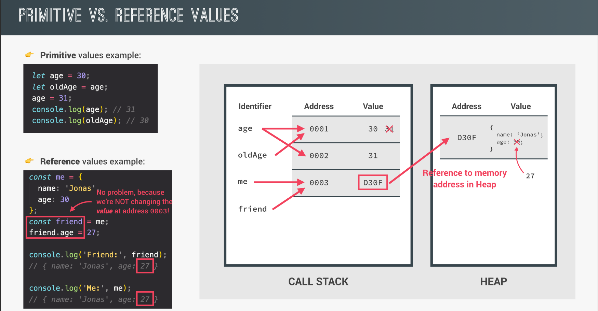

# Primitives vs Non-Primitives in JavaScript

In JavaScript, data types are categorized into **primitives** and **non-primitives**. Here's a brief explanation of the differences:

## 1. **Primitives**:

- **Data types**: `string`, `number`, `boolean`, `null`, `undefined`, `symbol`, `bigint`.
- **Immutable**: Their values cannot be changed once assigned.
- **Stored by value**: When you copy a primitive, it creates a copy of the value itself.

Example:

```javascript
let a = 5;
let b = a; // b is a copy of a, not linked to it
a = 10;
console.log(b); // Output: 5 (independent of a)
```

## 2. **Non-Primitives (Objects)**:

- **Data types**: `objects`, `arrays`, `functions`.
- **Mutable**: You can change the properties of objects or contents of arrays.
- **Stored by reference**: When you copy an object, both variables point to the same memory location.

Example:

```javascript
let obj1 = { value: 5 };
let obj2 = obj1; // obj2 references the same object as obj1
obj1.value = 10;
console.log(obj2.value); // Output: 10 (both are linked)
```

<p align="center">
  
</p>
